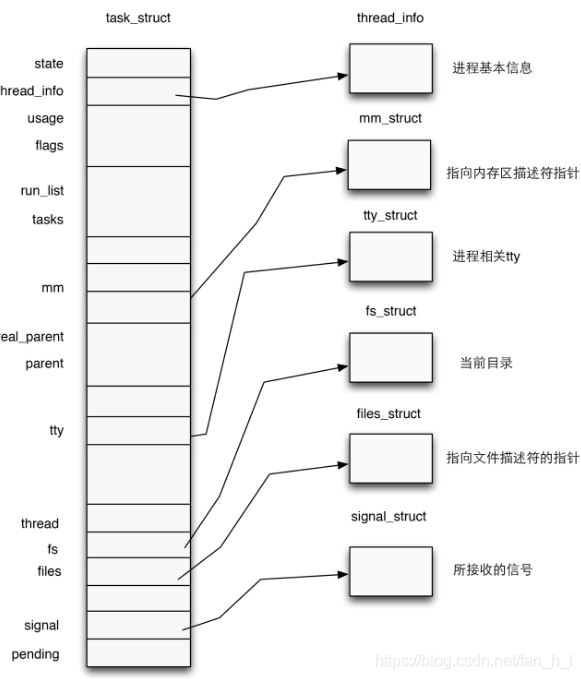

# Linux Kernel进程管理

**Outline**

- 进程和线程 (*Process and Thread*)
- 进程描述符 (*Process Descriptor*)
- PID
- 等待队列 (*Wait Queues*)
- 进程的切换
- 进程的创建和销毁

----

## 1 进程和线程

[内核线程、轻量级进程、用户线程三种线程概念解惑（线程≠轻量级进程）](https://blog.csdn.net/gatieme/article/details/51481863)

### 1.1 简介

- **进程**：程序运行的一个**实例**
  - **资源管理的单位**和实体（**分配资源时以进程为单位进行，而不是以线程**）
- **线程**：进程的一个**执行流 (*Execution Flow*)**
  - Pthread库 (*POSIX thread*)
  - **程序执行的单位**
- 为什么需要使用线程？
  - 需要**并行 *Parallelism***（单线程利用率低）
  - **多进程的额外开销大**（进程之间的切换需要对很多东西（如上下文）进行操作，线程切换不需要进行上下文等的切换，位于同一个线程内部）
- “缺陷”：需要**同步**

--------

## 1.2 内核线程

- **内核的一个 *Clone***：
  - **每个内核线程提供一个特定的功能**
    - 应对针对内核的多个功能的请求，多线程并行处理
    - 异步IO
  - 仅在内核态运行
  - **使用的线性地址大于 *PAGE_OFFSET*** (?)
- 低开销
  - ...

---

## 1.3 轻量级进程 (*Lightweight procss, LWP*)

- 用以更好地支持多线程
- 是**建立在内核之上并由内核支持的用户线程**，它是**内核线程的高度抽象**，**每一个轻量级进程都与一个特定的内核线程关联**。内核线程只能由内核管理并像普通进程一样被调度。
- 由clone()系统调用创建，参数是CLONE_VM，即与父进程是共享进程地址空间和系统资源。
- **线程的一种实现方式** $\star$
  - 线程可以实现为 *LWP*
- 层级关系：
  - 进程 $\Rightarrow$ LWP $\Rightarrow$ 内核线程/内核 $\Rightarrow$ 线程调度 
  - 注意：该实现方式在Linux中仅适用于内核线程，不适用于用户线程
  - 操作系统能够知道程序的线程使用情况（用户线程则无法知道，仅把整个进程作为整体处理）
- 与普通进程区别：LWP只有一个最小的执行上下文和调度程序所需的统计信息
  - 处理器竞争：因与特定内核线程关联，因此**可以在全系统范围内竞争处理器资源**
  - 使用资源：**与父进程共享进程地址空间**
  - 调度：像普通进程一样调度
- LWP的限制
  - 需要频繁的系统调用
  - 占据一定的内核资源

---------

## 2 进程描述符

### 2.1 识别进程

- 进程描述符指针：32-bit
- 进程ID (PID)：16-bit
  - 每一个进程或LWP和一个PID关联
  - 希望同一组线程具有同样的PID
  - ...

-----

### 2.2 进程描述符

[进程与进程描述符(process descriptor)](https://blog.csdn.net/fan_h_l/article/details/99685353)

- 类型结构：

  

  - 进程状态 *state*：七种状态

    - *TASK_RUNNING*：**运行态**（可以运行（传统意义上的正在运行），不代表当前时刻正在运行，原因是计算机资源有限，可能在资源调度下瞬时处于idle）
    - *TASK_INTERRUPTABLE*：**挂起态** (sleeping)，可被中断/信号所唤醒的挂起态
    - *TASK_UNITERRUPTABLE*：同样为挂起态，无法被唤醒
    - *TASK_STOPPED*：**停止态**
    - *TASK_TRACED*：**调试态**
    - *EXIT_ZOMBIE*：**僵尸态**
    - *EXIT_DEAD*：**杀死态**

  - 进程基本信息 *thread_info*

    

    - 内核态堆栈中的8KB，从小地址端开始
    - 如何知道进程信息？
      - 根据esp硬件寄存器
      - task指针

- **双向循环链表 (list_head 数据结构)**
  - 将不同状态的进程分别串联在一起
    - 所有进程
    - 运行中的进程
    - ...
  - **进程链表**：所有进程的链表，使用的字段是 *task_struct*
  - **TASK_RUNNING状态的进程链表 (*runqueue*)**：
    - 运行进程中的链表
    - 使用的字段是 *run_list*，类型是 *list_head*
    - 按照优先级划分成多个子链表，对应进程描述符好中的 *array* 字段
      - nr_active：链表中进程描述符的数量
      - bitmap：每个bit代表相应优先级的链表是否为空
      - queue：多个链表头 *list_heads*

-------

### 2.3 进程间的生成关系

- Process 0 and 1：由内核创建
- 进程描述符中描述生成关系的字段 (parenthood relationships)：
  - real_parent：固定不变
  - parent：可变，例如进程调试时变为调试的进程
  - ...

----

## 3 PID

### 3.1 PID

- 进程描述符中的 *pids* 字段：pid数据结构
  - *nr*：pid的值
  - ...
- ...

------------

### 3.2 pidhash哈希表和chained链表

- **目的是支持根据PID寻找相应的进程描述符**
  - 串行搜索进程链表非常低效，数组（桶排序思想）方式浪费空间
- 每个pidhash表的大小：和可用内存有关，可变（大小适中为宜）
- pidhash哈希表为整个系统共用
- chain链表用来处理碰撞

- 已知pid，如何找到相应的进程描述符？
  - 难点：内核需要知道哈希表的位置  $\Rightarrow$  内核维护 *pid_hash*，由

- *pid_hash* 数组包含4个哈希表以及进程描述符
  - 每个进程有四个ID，分别对应一个哈希表
    - ...
- pidhash哈希表的处理函数和宏

-------

## 4 等待队列 *Waiting Queue*

- 处于*TASK_STOPPED*、*EXIT_ZOMBIE*、*EXIT_DEAD* 状态的进程：不再链表中
- 处于 *TASK_INTERRUPTABLE*、*TASK_UNINTERRUPTABLE*状态的进程：位于等待列表中
- 两种睡眠状态的进程：
  - *Exclusive process*：排他进程，仅可以唤醒一个，如打印（因为只有一块供打印的地方）
  - *Nonexclusive process*：非排他进程，可以同时唤醒多个，如读（多个进程想要读同一个内容，当内容被读入时这几个进程同时被唤醒）
    - 总在事件发生时由内核唤醒

---------

## 5 进程切换

### 5.1 进程切换、任务切换、上下文切换

----

## 6. 进程的创建和销毁

### 6.1 创建进程

- **写时拷贝 *Copy on Write***
  - ...
- ...

----

### 6.2 销毁进程

- 

