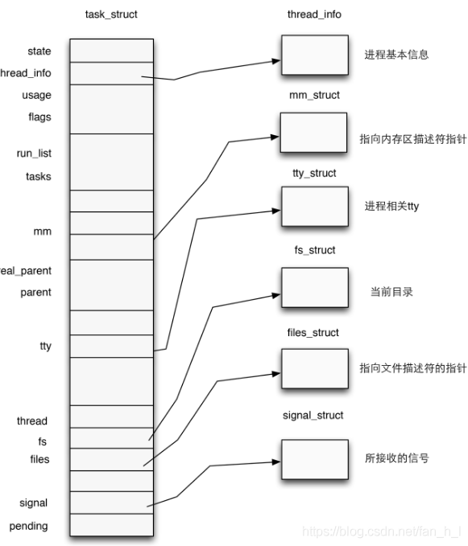

# Lecture 2 进程管理

**Outline**

- 进程和线程 (*Process and Thread*)
- 进程描述符 (*Process Descriptor*)
- PID
- 等待队列 (*Wait Queues*)
- 进程的切换
- 进程的创建和销毁

----

## 1 进程和线程

[内核线程、轻量级进程、用户线程三种线程概念解惑（线程≠轻量级进程）](https://blog.csdn.net/gatieme/article/details/51481863)

#### 1.1 简介

- **进程**：程序运行的一个**实例**
  - **资源管理的单位**和实体（**分配资源时以进程为单位进行，而不是以线程**）
- **线程**：进程的一个**执行流 (*Execution Flow*)**
  - Pthread库 (*POSIX thread*)
  - **程序执行的单位**
- 为什么需要使用线程？
  - 需要**并行 *Parallelism***（单线程利用率低）
  - **多进程之间的进程间通信 *IPC* 较为复杂** 
  - **多进程的额外开销大**（进程之间的切换需要对很多东西（如上下文）进行操作，线程切换不需要进行上下文等的切换，位于同一个进程内部）
- “缺陷”：需要**同步**

--------

#### 1.2 内核线程

- **内核的一个 *Clone***：
  - **硬件支持为多线程内核**
  - **每个内核线程提供一个特定的功能**
    - 应对针对内核的多个功能的请求，多线程并行处理
    - 异步IO
  - 仅在内核态运行
  - **使用的线性地址大于 *PAGE_OFFSET*** 
- 低开销，**资源占用很少**，仅内核栈和上下文切换时保存寄存器的空间
- 资源同步和数据共享效率较低

-----------

#### 1.3 轻量级进程 (*Lightweight procss, LWP*)

- 用以更好地支持多线程
- 是**建立在内核之上并由内核支持的用户线程**，它是**内核线程的高度抽象**，**每一个轻量级进程都与一个特定的内核线程关联**。内核线程只能由内核管理并像普通进程一样被调度。
- 由clone()系统调用创建，参数是CLONE_VM，即与父进程是共享进程地址空间和系统资源。
- **线程的一种实现方式** $\star$
  - 线程可以实现为 *LWP*
- 层级关系：
  - 进程 $\Rightarrow$ LWP $\Rightarrow$ 内核线程/内核 $\Rightarrow$ 线程调度 
  - 注意：该实现方式在Linux中仅适用于内核线程，不适用于用户线程
  - 操作系统能够知道程序的线程使用情况（用户线程则无法知道，仅把整个进程作为整体处理）
- **与普通进程区别：LWP只有一个最小的执行上下文和调度程序所需的统计信息**
  - 处理器竞争：因与特定内核线程关联，因此**可以在全系统范围内竞争处理器资源**
  - 使用资源：**与父进程共享进程地址空间**
  - 调度：像普通进程一样调度
- LWP的限制
  - 需要频繁的系统调用，开销较大
  - 占据一定的内核资源

---------

#### 1.4 用户线程

- **完全建立在用户空间的线程库**，用户线程的创建、调度、同步和销毁全由库函数在用户空间完成，**不需要内核的帮助**
- 低消耗，高效
- 单纯的用户线程是建立在用户空间，其**对内核是透明的**，因此**其所属进程单独参与处理器的竞争**，而**进程的所有线程参与竞争该进程的资源**。
- 由在用户空间实现的线程库，**在所属进程内进行调度**
- 与 *LWP* 的区别：**LWP虽然本质上属于用户线程**，但LWP线程库是建立在内核之上的，LWP的许多操作都要进行系统调用，因此效率不高。而这里的用户线程指的是完全建立在用户空间的线程库，用户线程的建立，同步，销毁，调度完全在用户空间完成，不需要内核的帮助。因此这种线程的操作是极其快速的且低消耗的。
- 下面模型的缺点：若一个线程阻塞在系统调用中，则整个进程都会阻塞

- **用户进程和 *LWP* 的结合**：多对多模型
    - 用户线程库还是完全建立在用户空间中，因此用户线程的操作还是很廉价，因此可以建立任意多需要的用户线程。
    - 提供了LWP作为用户线程和内核线程之间的桥梁。LWP具有内核线程支持，是内核的调度单元，并且**用户线程的系统调用要通过LWP**，**因此进程中某个用户线程的阻塞不会影响整个进程的执行**。
    - 用户线程库将建立的用户线程关联到LWP上，LWP与用户线程的数量不一定一致。当内核调度到某个LWP上时，此时与该LWP关联的用户线程就被执行。

---------

## 2 进程描述符

### 2.1 识别进程

- 进程描述符指针：32-bit
- 进程ID (PID)：16-bit
  - **每一个进程或LWP和一个PID关联**
  - 希望同一组线程具有同样的PID
  - **线程组**：*LWP* 的集合，线程组内第一个 *LWP* 的 *PID* 作为组 *ID*

--------------

### 2.2 进程描述符

[进程与进程描述符(process descriptor)](https://blog.csdn.net/fan_h_l/article/details/99685353)

- 类型结构：

  

  - 进程状态 *state*：七种状态

    - *TASK_RUNNING*：**运行态**（可以运行（传统意义上的正在运行），不代表当前时刻正在运行，原因是计算机资源有限，可能在资源调度下瞬时处于idle）
    - *TASK_INTERRUPTABLE*：**挂起态** (sleeping)，可被中断/信号所唤醒的挂起态
    - *TASK_UNITERRUPTABLE*：同样为挂起态，无法被唤醒
    - *TASK_STOPPED*：**停止态**
    - *TASK_TRACED*：**调试态**
    - *EXIT_ZOMBIE*：**僵尸态**
    - *EXIT_DEAD*：**杀死态**

  - 进程基本信息 *thread_info*

    

    - 内核态堆栈中的8KB，从小地址端开始
    - 如何知道进程信息？
      - 根据**esp硬件寄存器**，获取 *thread_info* 的地址（`current_thread_info()`）
      - 当前 *CPU* 上正在运行进程的**进程描述符指针**，`current` 宏，等价于 `current_thread_info()->task`

- 多个进程的组织形式：**双向循环链表 (*list_head* 数据结构)**

  - **将不同状态的进程分别串联在一起**
    - 所有进程
    - 运行中的进程
    - ...
  - **进程链表**：所有进程的链表，使用的字段是 *task_struct* 结构中的 `struct list_head tasks` 字段，注意与 `task` 字段区分，其指向当前进程的 *task_struct*
  - **TASK_RUNNING状态的进程链表 (*runqueue*)**：
    - 使用的字段是 *run_list*，类型是 *list_head*
    - 按照优先级划分成多个子链表，对应进程描述符中的 *array* 字段
      - nr_active：链表中进程描述符的数量
      - bitmap：每个bit代表相应优先级的链表是否为空
      - queue：多个链表头 *list_heads*

--------------

### 2.3 进程间的生成关系

- Process 0 and 1：由内核创建
- **进程描述符中描述生成关系的字段 (parenthood relationships)**：
  - real_parent：固定不变
  - parent：可变，例如进程调试时变为调试的进程
  - children：子进程
  - sibling：（`prev / next`）兄弟进程，最后一个指向父进程

------------

## 3 进程 *ID* （*PID*）

### 3.1 PID

- 进程描述符中的 `pids` 字段：pid数据结构
  - `nr`：pid的值
  - `pid_chain`：指向哈希链表的前后元素
  - `pid_list`：指向线程组的前后元素

------------

### 3.2 pidhash哈希表和chained链表

- **目的是支持根据PID寻找相应的进程描述符**
  - 串行搜索进程链表非常低效，数组（桶排序思想）方式浪费空间
- **每个pidhash表的大小：和可用内存有关**，可变（大小适中为宜）
- **pidhash哈希表为整个系统共用**
- **chain链表用来处理碰撞**

- 已知pid，如何找到相应的进程描述符？
  - 难点：内核需要知道哈希表的位置  $\Rightarrow$  内核维护 *pid_hash*

- *pid_hash* 数组包含4个哈希表（PID、TGID、PGID、SID）以及进程描述符
- pidhash哈希表的处理函数和宏

-------

## 4 等待队列 *Waiting Queue*：进程的组织方式

- 处于*TASK_STOPPED*、*EXIT_ZOMBIE*、*EXIT_DEAD* 状态的进程：不再链表中
- 处于 *TASK_INTERRUPTABLE*、*TASK_UNINTERRUPTABLE*状态的进程：位于**等待队列**中
- 两种睡眠状态的进程：
  - *Exclusive process*：排他进程，仅可以唤醒一个，如打印（因为只有一块供打印的地方）
  - *Nonexclusive process*：非排他进程，可以同时唤醒多个，如读（多个进程想要读同一个内容，当内容被读入时这几个进程同时被唤醒）
    - 总在事件发生时由内核唤醒

---------

## 5 进程切换

### 5.1 进程切换、任务切换、上下文切换

- **硬件上下文切换**：*a far jump*（老版 *Linux*）
- **软件上下文切换**：一组 `mov` 指令（可以**更好地控制和验证加载数据的有效性**，时间消耗大体相当）
- **进程切换的流程**：
    - 切换**页全局目录** *Page Global Directory*
    - 切换**内核态堆栈 *kernel mode stack*** 以及**硬件上下文 *hardware context***
        - 任务状态段 *Task State Segment*：*X86* 架构中用来存储硬件上下文的特定的段类型

----

## 6. 进程的创建和销毁

### 6.1 创建进程

- **写时拷贝 *Copy on Write***：父进程和子进程读同样的物理页
- **轻量级进程 *LWP***：父子进程共享 *per-process* 内核数据结构（进程地址空间）
- **`vfork()` 系统调用**：父子进程共享内存地址空间

----

​		`clone` 基于不同的函数参数，能够提供更加强大的功能。`vfork()` 会导致父进程的挂起。

### 6.2 销毁进程

- `exit()` 库函数：
    - `_exit()`
    - `exit_group()`
    - 移除进程：`release_task()` 释放僵尸进程的进程描述符

